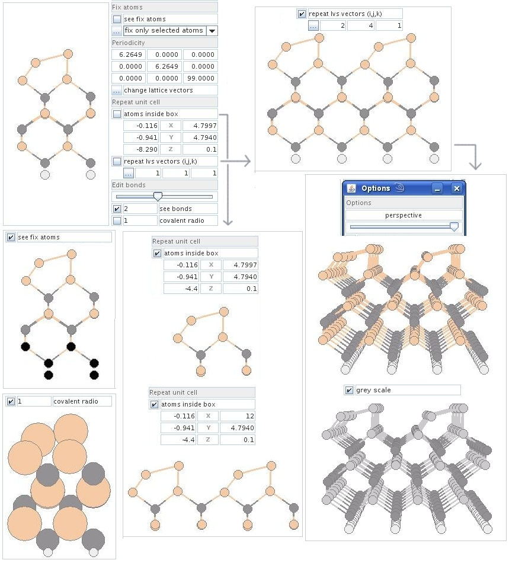

#  xeo

**xeo** is a free (GPLv3) project manager for nanostructures, written in Java.

It provides a graphical environment to build, visualize and edit atomic
structures, prepare input files and analyze the output of several
electronic-structure codes:

- [Fireball](https://fireball-qmd.github.io/) (including STM/AFM simulations)
- VASP
- ABINIT
- CASTEP
- Generic `.xyz` / `.bas` structures

It also integrates with external tools such as **Open Babel** (format
conversion, via the bundled `xeoBabel` plugin) and **POV-Ray** (high-quality
rendering of structures).



## Requirements

- Java Runtime Environment (JRE) — the only hard requirement
- Optional: [Open Babel](https://openbabel.org/), [POV-Ray](https://www.povray.org/)
  and the simulation codes you want to drive (Fireball, VASP, ...)

## Installation

```bash
git clone https://github.com/dgtrabada/xeo
cd xeo
./install
```

The `install` script sets up the example profiles and copies the user
configuration to `$HOME/.xeorc` (an existing `.xeorc` is preserved, only the
help files are refreshed).

To have `xeo` available from anywhere, add it to your `PATH`
(e.g. in `~/.bashrc`):

```bash
export PATH="$PATH:/path/to/xeo"
```

## Running

```bash
./xeo              # launcher script (recommended)
java -jar xeo.jar  # or run the jar directly
```

## Command-line tools

Besides the GUI, xeo bundles several command-line utilities:

```text
xeo -version
xeo -Calc 4+8                                   # calculator
xeo -Aver file [col]                            # column average of a data file
xeo -xyz file.xyz output.dat timeStep <expr>    # evaluate expressions over an xyz trajectory
xeo -aver_xyz file.xyz [-i initial final]       # average structure of a trajectory
xeo -Bulk [bcc|fcc|zincblende|file file.lvs]    # build bulk structures
xeo -editor file                                # text editor / image viewer
xeo -plotNY file1 file2 ...                     # plot data files
xeo -plotXNY [visible] file
xeo -plotXNY-AjY [visible] Yini Yfin file
```

Run `xeo -help` for the full list.

## Examples

The [`examples/`](examples) directory contains ready-to-open projects for the
supported codes (Fireball, VASP, ABINIT, CASTEP, STM/AFM, molecular dynamics,
spin, ...). After running `./install`, they are preloaded in the profile so
you can open them directly from the GUI.

## Building from source

The project uses Ant (NetBeans project layout):

```bash
ant jar   # produces dist/xeo.jar
```

## License

xeo is free software released under the [GNU GPLv3](gpl-3.0.txt).

Copyright © 2009 Daniel González Trabada

This program comes with ABSOLUTELY NO WARRANTY; for details run `xeo show w`.
This is free software, and you are welcome to redistribute it under certain
conditions; run `xeo show c` for details.
